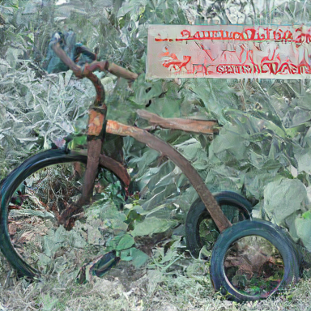
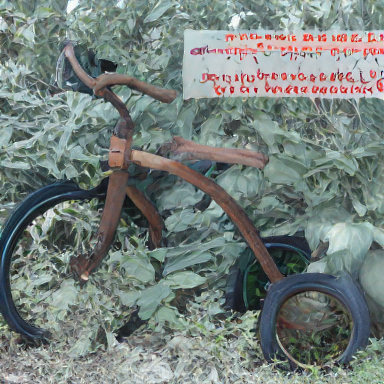
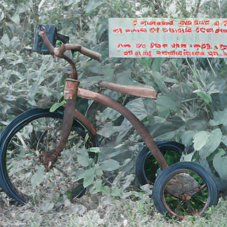
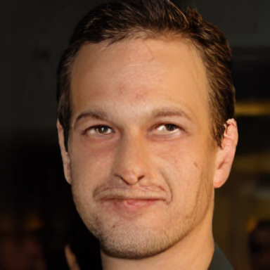
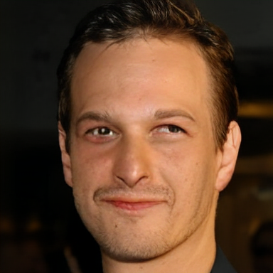
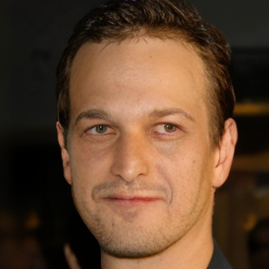
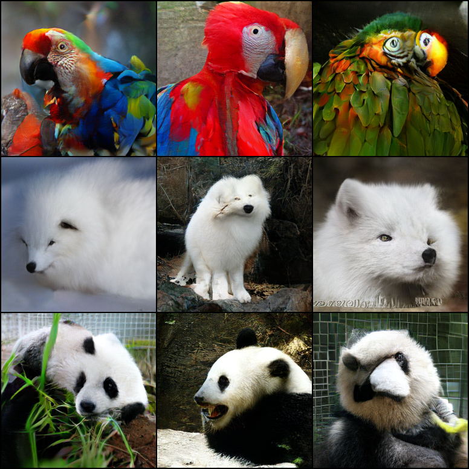
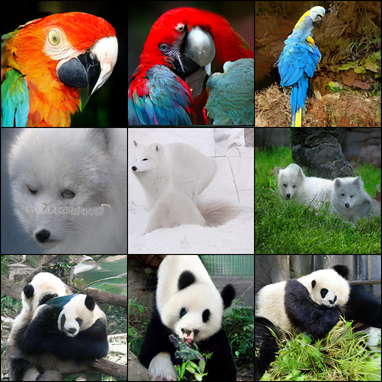
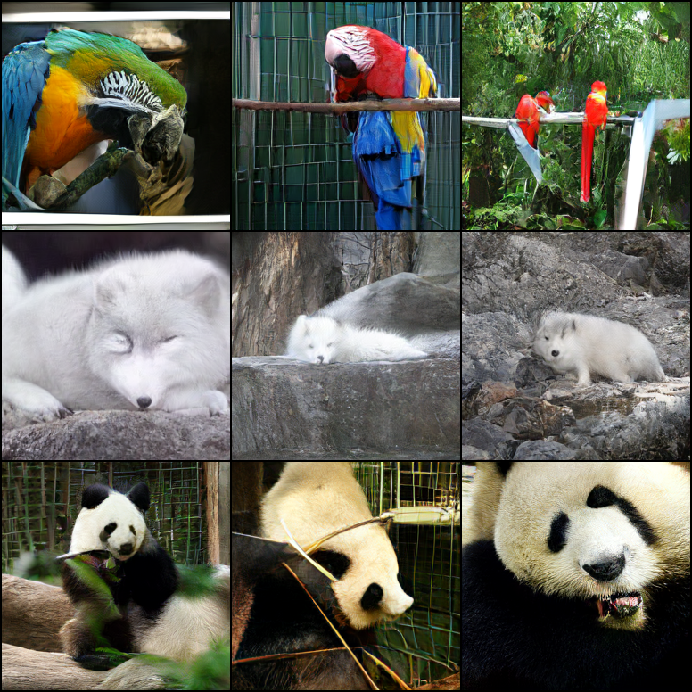

# maskgit-pytorch

Unofficial PyTorch implementation of [MaskGIT: Masked Generative Image Transformer](http://arxiv.org/abs/2202.04200). The official Jax implementation can be found [here](https://github.com/google-research/maskgit).

<br/>


## Installation

> The code is tested with python 3.12, torch 2.4.1 and cuda 12.4.

Clone this repo:

```shell
git clone https://github.com/xyfJASON/maskgit-pytorch.git
cd maskgit-pytorch
```

Create and activate a conda environment:

```shell
conda create -n maskgit python=3.12
conda activate maskgit
```

Install dependencies:

```shell
pip install torch==2.4.1 torchvision==0.19.1 --index-url https://download.pytorch.org/whl/cu124
pip install -r requirements.txt
```

<br/>


## Stage-1 (VQGAN)

Instead of training a VQGAN from scratch, we directly use the pretrained VQGANs from the community as the image tokenizer.


### Download

We support loading the pretrained VQGAN models from several open-source projects, including:

**VQGAN-MaskGIT**: The pretrained VQGAN used in the original MaskGIT paper is implemented in Jax. The community has converted the model weights to PyTorch, which can be downloaded by:

```shell
mkdir -p ckpts
wget 'https://huggingface.co/fun-research/TiTok/resolve/main/maskgit-vqgan-imagenet-f16-256.bin' -O 'ckpts/maskgit-vqgan-imagenet-f16-256.bin'
```

**VQGAN-Taming**: The pretrained VQGAN from [taming-transformers](https://github.com/CompVis/taming-transformers) can be downloaded by:

```shell
mkdir -p ckpts/taming
wget 'https://heibox.uni-heidelberg.de/f/867b05fc8c4841768640/?dl=1' -O 'ckpts/taming/vqgan_imagenet_f16_16384.ckpt'
wget 'https://heibox.uni-heidelberg.de/f/274fb24ed38341bfa753/?dl=1' -O 'ckpts/taming/vqgan_imagenet_f16_16384.yaml'
```

**VQGAN-LlamaGen**: The pretrained VQGAN from [llamagen](https://github.com/FoundationVision/LlamaGen) can be downloaded by:

```shell
mkdir -p ckpts/llamagen
wget 'https://huggingface.co/FoundationVision/LlamaGen/resolve/main/vq_ds16_c2i.pt' -O 'ckpts/llamagen/vq_ds16_c2i.pt'
```

**VQGAN-aMUSEd**: The pretrained VQGAN from [amused](https://huggingface.co/amused/amused-256) will be automatically downloaded when running the training / evaluation script.

<br/>


### Evaluation

```shell
torchrun --nproc-per-node 4 evaluate_vqmodel.py \
  --model_name MODEL_NAME \
  --dataroot IMAGENET_DATAROOT \
  [--save_dir SAVE_DIR] \
  [--bspp BATCH_SIZE_PER_PROCESS]
```

- `--model_name`: name of the pretrained VQGAN model. Options:
  - `maskgit-vqgan-imagenet-f16-256`
  - `taming/vqgan_imagenet_f16_16384`
  - `llamagen/vq_ds16_c2i`
  - `amused/amused-256`
- `--dataroot`: the root directory of the ImageNet dataset.
- `--save_dir`: the directory to save the reconstructed images.
- `--bspp`: batch size per process.

**Quantitative reconstruction results on ImageNet (256x256) validation set**:

|              Model Name               | Codebook Size | Codebook Dim |  PSNR ↑   |  SSIM ↑  | LPIPS ↓  |  rFID ↓  |
|:-------------------------------------:|:-------------:|:------------:|:---------:|:--------:|:--------:|:--------:|
|   `maskgit-vqgan-imagenet-f16-256`    |     1024      |     256      |   18.15   |   0.43   |   0.20   | **2.12** |
|   `taming/vqgan_imagenet_f16_16384`   |     16384     |     256      |   20.01   |   0.50   |   0.17   |   5.00   |
|        `llamagen/vq_ds16_c2i`         |     16384     |      8       |   20.79   |   0.56   | **0.14** |   2.19   |
|          `amused/amused-256`          |     8192      |      64      | **21.81** | **0.58** | **0.14** |   4.41   |

**Qualitative reconstruction results (384x384)**:

<table>
<tr>
    <td align="center">original</td>
    <td align="center">maskgit</td>
    <td align="center">taming</td>
    <td align="center">llamagen</td>
    <td align="center">amused</td>
</tr>
<tr>
    <td width="12%"></td>
    <td width="12%"></td>
    <td width="12%"></td>
    <td width="12%"></td>
    <td width="12%"></td>
</tr>
<tr>
    <td width="12%"></td>
    <td width="12%"></td>
    <td width="12%"></td>
    <td width="12%"></td>
    <td width="12%"></td>
</tr>
</table>

The original images are taken from ImageNet and CelebA-HQ respectively.
It's worth noting that models trained on ImageNet (VQGAN-MaskGIT, VQGAN-Taming, and VQGAN-LlamaGen) cannot generalize well to human faces.
Therefore, in the stage-2 training, we use VQGAN-aMUSEd for the FFHQ dataset, and VQGAN-MaskGIT for the ImageNet dataset by default.

<br/>


## Stage-2 (Bidirectional Transformer)

### Training

**Step 1 (optional): cache the latents**.
Caching the latents encoded by VQGAN can greatly accelerate the training and decrease the memory usage in the stage-2 training.
However, make sure you have enough disk space to store the cached latents.

|         Dataset         |   VQGAN type   | Disk space required | Disk space required<br/>`--full` |
|:-----------------------:|:--------------:|:-------------------:|:--------------------------------:|
|          FFHQ           |  VQGAN-aMUSEd  |       \> 278M       |              \> 18G              |
| ImageNet (training set) | VQGAN-MaskGIT  |       \> 5.6G       |             \> 1.3T              |

```shell
torchrun --nproc-per-node 4 make_cache.py -c CONFIG --save_dir CACHEDIR [--bspp BATCH_SIZE_PER_PROCESS] [--full]
```

- `-c`: path to the config file, e.g., `./configs/imagenet256.yaml`.
- `--save_dir`: the directory to save the cached latents.
- `--bspp`: batch size per process.
- `--full`: cache full latents, unnecessary for training MaskGIT.

**Step 2: start training**.
To train an **unconditional** model (e.g. FFHQ), run the following command:

```shell
# if not using cached latents
torchrun --nproc-per-node 4 train.py -c CONFIG [-e EXPDIR] [-mp MIXED_PRECISION]
# if using cached latents
torchrun --nproc-per-node 4 train.py -c CONFIG [-e EXPDIR] [-mp MIXED_PRECISION] --data.name cached --data.root CACHEDIR
```

To train a **class-conditional** model (e.g. ImageNet), run the following command:

```shell
# if not using cached latents
torchrun --nproc-per-node 4 train_c2i.py -c CONFIG [-e EXPDIR] [-mp MIXED_PRECISION]
# if using cached latents
torchrun --nproc-per-node 4 train_c2i.py -c CONFIG [-e EXPDIR] [-mp MIXED_PRECISION] --data.name cached --data.root CACHEDIR
```

- `-c`: path to the config file, e.g., `./configs/imagenet256.yaml`.
- `-e`: the directory to save the experiment logs. Default: `./runs/<current time>`.
- `-mp`: mixed precision training. Options: `fp16`, `bf16`.

<br/>


### Sampling

To sample from the trained **unconditional** model (e.g., FFHQ), run the following command:

```shell
torchrun --nproc-per-node 4 sample.py \
  -c CONFIG \
  --weights WEIGHTS \
  --n_samples N_SAMPLES \
  --save_dir SAVEDIR \
  [--make_npz] \
  [--seed SEED] \
  [--bspp BATCH_SIZE_PER_PROCESS] \
  [--sampling_steps SAMPLING_STEPS] \
  [--topk TOPK] \
  [--softmax_temp SOFTMAX_TEMP] \
  [--base_gumbel_temp BASE_GUMBEL_TEMP]
```

- `-c`: path to the config file, e.g., `./configs/ffhq256.yaml`.
- `--weights`: path to the trained model weights.
- `--n_samples`: number of samples to generate.
- `--save_dir`: the directory to save the generated samples.
- `--make_npz`: make `.npz` file for evaluation. Default: False.
- `--seed`: random seed. Default: 8888.
- `--bspp`: batch size per process. Default: 100.
- `--sampling_steps`: number of sampling steps. Default: 8.
- `--topk`: only select from the top-k tokens in each sampling step. Default: None.
- `--softmax_temp`: softmax temperature. Default: 1.0.
- `--base_gumbel_temp`: temperature for gumbel noise. Default: 4.5.

To sample from the trained **class-conditional** model (e.g., ImageNet), run the following command:

```shell
torchrun --nproc-per-node 4 sample_c2i.py \
  -c CONFIG \
  --weights WEIGHTS \
  --n_samples N_SAMPLES \
  --save_dir SAVEDIR \
  [--make_npz] \
  [--cfg CFG] \
  [--cfg_schedule CFG_SCHEDULE] \
  [--seed SEED] \
  [--bspp BATCH_SIZE_PER_PROCESS] \
  [--sampling_steps SAMPLING_STEPS] \
  [--topk TOPK] \
  [--softmax_temp SOFTMAX_TEMP] \
  [--base_gumbel_temp BASE_GUMBEL_TEMP]
```

- `--cfg`: classifier free guidance. Default: 1.0.
- `--cfg_schedule`: schedule for classifier free guidance. Options: "constant", "linear", "linear-r", "power-cosine-[num]". Default: "linear-r".

<br/>


### Evaluation

We use [OpenAI's ADM Evaluations](https://github.com/openai/guided-diffusion/tree/main/evaluations) to evaluate the image quality.
Please follow their instructions.

The `.npz` file required for evaluation will be automatically made in the sampling script if `--make_npz` is set.
However, you can also make it manually by running:

```shell
python make_npz.py --sample_dir SAMPLE_DIR
```

The script will recursively search for all the images in `SAMPLE_DIR` and save them in `SAMPLE_DIR.npz`.

<br/>


### Results (class-conditional ImageNet 256x256)

Below we show the quantitative and qualitative results of class-conditional ImageNet (256x256).
As a reference, the original MaskGIT paper reports FID=6.18 and IS=182.1 with 8 sampling steps without classifier-free guidance (CFG=1).

**Quantitative results**:

| EMA Model | Sampling Steps |      CFG      | FID ↓ |  IS ↑  | Precision ↑ | Recall ↑ |
|:---------:|:--------------:|:-------------:|:-----:|:------:|:-----------:|:--------:|
|    Yes    |       8        |      1.0      | 7.38  | 134.53 |    0.84     |   0.46   |
|    Yes    |       8        | linear-r(2.0) | 5.54  | 203.69 |    0.89     |   0.41   |
|    Yes    |       8        | linear-r(3.0) | 6.52  | 253.59 |    0.92     |   0.37   |

**Uncurated samples**:

<table>
<tr>
    <td align="center">8 steps, cfg=1.0</td>
    <td align="center">8 steps, cfg=linear-r(2.0)</td>
    <td align="center">8 steps, cfg=linear-r(3.0)</td>
</tr>
<tr>
    <td width="30%"></td>
    <td width="30%"></td>
    <td width="30%"></td>
</tr>
</table>

<br/>


## References

MaskGIT:

```
@inproceedings{chang2022maskgit,
  title={Maskgit: Masked generative image transformer},
  author={Chang, Huiwen and Zhang, Han and Jiang, Lu and Liu, Ce and Freeman, William T},
  booktitle={Proceedings of the IEEE/CVF Conference on Computer Vision and Pattern Recognition},
  pages={11315--11325},
  year={2022}
}
```

VQGAN (Taming Transformers):

```
@inproceedings{esser2021taming,
  title={Taming transformers for high-resolution image synthesis},
  author={Esser, Patrick and Rombach, Robin and Ommer, Bjorn},
  booktitle={Proceedings of the IEEE/CVF conference on computer vision and pattern recognition},
  pages={12873--12883},
  year={2021}
}
```

LlamaGen:

```
@article{sun2024autoregressive,
  title={Autoregressive Model Beats Diffusion: Llama for Scalable Image Generation},
  author={Sun, Peize and Jiang, Yi and Chen, Shoufa and Zhang, Shilong and Peng, Bingyue and Luo, Ping and Yuan, Zehuan},
  journal={arXiv preprint arXiv:2406.06525},
  year={2024}
}
```

aMUSEd:

```
@misc{patil2024amused,
  title={aMUSEd: An Open MUSE Reproduction}, 
  author={Suraj Patil and William Berman and Robin Rombach and Patrick von Platen},
  year={2024},
  eprint={2401.01808},
  archivePrefix={arXiv},
  primaryClass={cs.CV}
}
```

A Pytorch Reproduction of Masked Generative Image Transformer:

```
@article{besnier2023pytorch,
  title={A Pytorch Reproduction of Masked Generative Image Transformer},
  author={Besnier, Victor and Chen, Mickael},
  journal={arXiv preprint arXiv:2310.14400},
  year={2023}
}
```

TiTok:

```
@inproceedings{yu2024an,
  title={An Image is Worth 32 Tokens for Reconstruction and Generation},
  author={Qihang Yu and Mark Weber and Xueqing Deng and Xiaohui Shen and Daniel Cremers and Liang-Chieh Chen},
  booktitle={The Thirty-eighth Annual Conference on Neural Information Processing Systems},
  year={2024},
  url={https://openreview.net/forum?id=tOXoQPRzPL}
}
```

Token-Critic:

```
@inproceedings{lezama2022improved,
  title={Improved masked image generation with token-critic},
  author={Lezama, Jos{\'e} and Chang, Huiwen and Jiang, Lu and Essa, Irfan},
  booktitle={European Conference on Computer Vision},
  pages={70--86},
  year={2022},
  organization={Springer}
}
```
