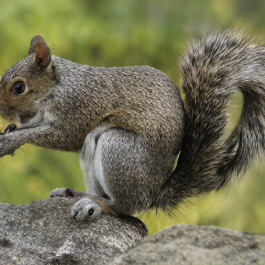
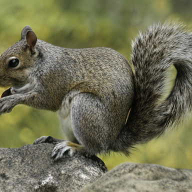
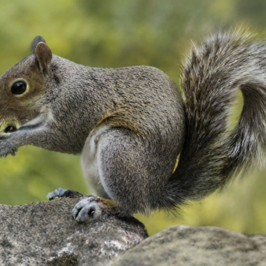
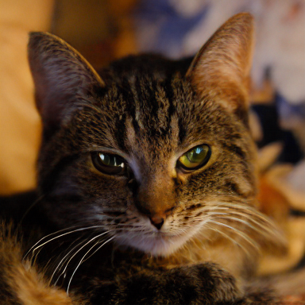
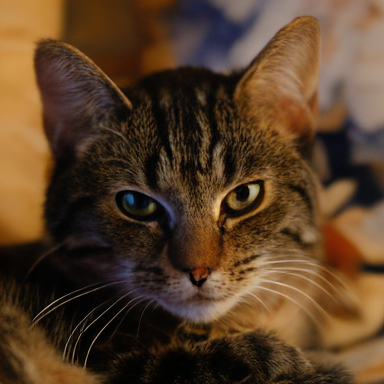
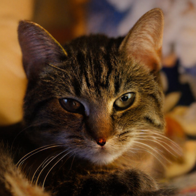

# maskgit-pytorch

Unofficial PyTorch implementation of [MaskGIT](http://arxiv.org/abs/2202.04200). The official Jax implementation can be found [here](https://github.com/google-research/maskgit).

> [!WARNING]
> The transformer architecture is not exactly the same as the official implementation.

<br/>


## 🛠️ Installation

> The code is tested with python 3.12, torch 2.4.1 and cuda 12.4.

Clone this repo:

```shell
git clone https://github.com/xyfJASON/maskgit-pytorch.git
cd maskgit-pytorch
```

Create and activate a conda environment:

```shell
conda create -n maskgit python=3.12
conda activate maskgit
```

Install dependencies:

```shell
pip install torch==2.4.1 torchvision==0.19.1 --index-url https://download.pytorch.org/whl/cu124
pip install -r requirements.txt
```

<br/>


## 🤖️ Pretrained Models

### 🤖️ Stage-1 Models (VQGAN)

> [!NOTE]
> This repo only focuses on the stage-2 of MaskGIT, i.e., the Masked Visual Token Modeling (MVTM) part.
We support loading the pretrained VQGAN from [taming-transformers](https://github.com/CompVis/taming-transformers), 
> [llamagen](https://github.com/FoundationVision/LlamaGen) and [amused](https://huggingface.co/amused/amused-256) 
> as the stage-1 models.

The pretrained VQGAN from [taming-transformers](https://github.com/CompVis/taming-transformers) can be downloaded by:

```shell
mkdir -p ckpts/taming
wget 'https://heibox.uni-heidelberg.de/f/867b05fc8c4841768640/?dl=1' -O 'ckpts/taming/vqgan_imagenet_f16_16384.ckpt'
wget 'https://heibox.uni-heidelberg.de/f/274fb24ed38341bfa753/?dl=1' -O 'ckpts/taming/vqgan_imagenet_f16_16384.yaml'
```

The pretrained VQGAN from [llamagen](https://github.com/FoundationVision/LlamaGen) can be downloaded by:

```shell
mkdir -p ckpts/llamagen
wget 'https://huggingface.co/FoundationVision/LlamaGen/resolve/main/vq_ds16_c2i.pt' -O 'ckpts/llamagen/vq_ds16_c2i.pt'
```

The pretrained VQGAN from [amused](https://huggingface.co/amused/amused-256) will be automatically downloaded when running the training / evaluation script.

<br/>


## 🚀 Evaluate Stage-1 Models (VQGAN)

```shell
accelerate-launch evaluate_vqmodel.py --model_name MODEL_NAME --dataroot DATAROOT
```

Quantitative reconstruction results on ImageNet (256x256):

|            Model Name             |  PSNR ↑   |  SSIM ↑  | LPIPS ↓  |  rFID ↓  |
|:---------------------------------:|:---------:|:--------:|:--------:|:--------:|
| `taming/vqgan_imagenet_f16_16384` |   20.01   |   0.50   |   0.17   |   5.00   |
|      `llamagen/vq_ds16_c2i`       |   20.79   |   0.56   | **0.14** | **2.19** |
|        `amused/amused-256`        | **21.81** | **0.58** | **0.14** |   4.41   |

Qualitative reconstruction results (384x384):

<table>
<tr>
    <td align="center">original</td>
    <td align="center">`taming`</td>
    <td align="center">`llamagen`</td>
    <td align="center">`amused`</td>
    <td align="center">original</td>
    <td align="center">`taming`</td>
    <td align="center">`llamagen`</td>
    <td align="center">`amused`</td>
</tr>
<tr>
    <td width="12%"></td>
    <td width="12%"></td>
    <td width="12%"></td>
    <td width="12%"></td>
    <td width="12%"></td>
    <td width="12%"></td>
    <td width="12%"></td>
    <td width="12%"></td>
</tr>
<tr>
    <td width="12%"></td>
    <td width="12%"></td>
    <td width="12%"></td>
    <td width="12%"></td>
    <td width="12%"></td>
    <td width="12%"></td>
    <td width="12%"></td>
    <td width="12%"></td>
</tr>
</table>

The original images are taken from taming-transformers, ImageNet, CelebA-HQ and AFHQ.

<br/>


## 🔥 Train Stage-2 Models (MaskGIT)

To train an unconditional MaskGIT model, run the following command:

```shell
accelerate-launch train.py -c CONFIG -e EXPDIR
```

<br/>


## 🖋️ References

MaskGIT:

```
@inproceedings{chang2022maskgit,
  title={Maskgit: Masked generative image transformer},
  author={Chang, Huiwen and Zhang, Han and Jiang, Lu and Liu, Ce and Freeman, William T},
  booktitle={Proceedings of the IEEE/CVF Conference on Computer Vision and Pattern Recognition},
  pages={11315--11325},
  year={2022}
}
```

VQGAN (Taming Transformers):

```
@inproceedings{esser2021taming,
  title={Taming transformers for high-resolution image synthesis},
  author={Esser, Patrick and Rombach, Robin and Ommer, Bjorn},
  booktitle={Proceedings of the IEEE/CVF conference on computer vision and pattern recognition},
  pages={12873--12883},
  year={2021}
}
```

LlamaGen:

```
@article{sun2024autoregressive,
  title={Autoregressive Model Beats Diffusion: Llama for Scalable Image Generation},
  author={Sun, Peize and Jiang, Yi and Chen, Shoufa and Zhang, Shilong and Peng, Bingyue and Luo, Ping and Yuan, Zehuan},
  journal={arXiv preprint arXiv:2406.06525},
  year={2024}
}
```

aMUSEd:

```
@misc{patil2024amused,
  title={aMUSEd: An Open MUSE Reproduction}, 
  author={Suraj Patil and William Berman and Robin Rombach and Patrick von Platen},
  year={2024},
  eprint={2401.01808},
  archivePrefix={arXiv},
  primaryClass={cs.CV}
}
```
